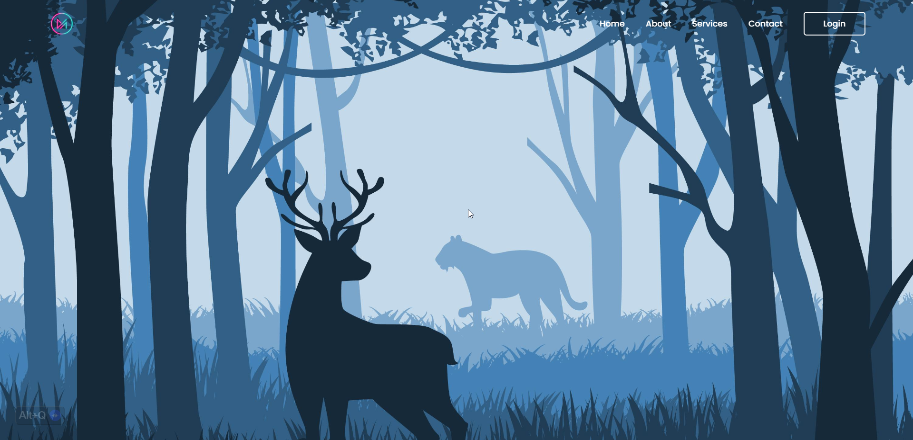

<!-- repository summary badges start -->
<div>
    
    
    
    
    
    
    
    
</div>
<!-- repository summary badges end -->

<br/>
<br/>

## CONTENTS:
- [Used Technology](#used-technology)
- [Used Colors](#used-colors)
- [Used Resources](#used-resources)
- [Extended Features](#extended-features)
- [My Learning](#my-learning)
	- [How to use multiple media queries?](#how-to-use-multiple-media-queries)
    - [How to access CSS variables using javascript?](#how-to-access-css-variables-using-javascript)
    - [How to change CSS variable value using javascript?](#how-to-change-css-variable-value-using-javascript)
    - [How to detect if the device is in portrait or landscape mode?](#how-to-detect-if-the-device-is-in-portrait-or-landscape-mode)
- [Live Site Link](#-live-site-link)
- [Credit](#credit)

<br/>

<details>
    <summary> PREVIEW </summary>
    <br/>
    
    
    
</details>

<br/>

### USED TECHNOLOGY

- HTML
- CSS
- JAVASCRIPT

<br/>

### USED COLORS

| Color      | Hex                                                          |
|------------|--------------------------------------------------------------|
| White      |  `#fff` |
| Navy |  `#162938` |

<br/>

### USED RESOURCES

- [WALLPAPER](./src/media/images/background.jpg)
- [ICONS](https://ionic.io/ionicons)
  - CLOSE ICON `<ion-icon name="close"></ion-icon>`
  - USER ICON `<ion-icon name="person"></ion-icon>`
  - EMAIL ICON `<ion-icon name="mail"></ion-icon>`
  - PASSWORD ICON `<ion-icon name="lock-closed"></ion-icon>`

<br/>

### EXTENDED FEATURES

- Responsive design
- Custom CSS variables
- Manipulation of CSS variables using JavaScript
- Device orientation detection

<br/>

### MY LEARNING

#### How to use multiple media queries?

  ```css
  @media only screen and (max-width: 480px) {
  
  }
  
  @media screen and (min-width: 481px) and (max-width: 768px) and (orientation: portrait) {
  
  }
  
  @media screen and (min-width: 481px) and (max-width: 768px) and (orientation: landscape) {
  
  }
  ```
  
#### How to access CSS variables using javascript?
  ```css
  :root {
      --deviceWidth: 375px;
      --deviceHeight: 667px;
  }
  ```
  ```javascript
  const root = document.querySelector(':root');
  const defaultDeviceWidth = getComputedStyle(root).getPropertyValue('--deviceWidth');
  const defaultDeviceHeight = getComputedStyle(root).getPropertyValue('--deviceHeight');
  
  console.log({defaultDeviceWidth});
  console.log({defaultDeviceHeight});
  ```

#### How to change CSS variable value using javascript?
  ```css
  :root {
      --deviceWidth: 375px;
      --deviceHeight: 667px;
  }
  ```
  ```javascript
  const root = document.querySelector(':root');
  
  root.style.setProperty('--deviceWidth', '480px');
  root.style.setProperty('--deviceHeight', '768px');
  
  console.log({deviceWidth});
  console.log({deviceHeight});
  ```

#### How to detect if the device is in portrait or landscape mode?
  ```javascript
  screen.orientation.addEventListener("change", function() {
      if (screen.orientation.type.includes("portrait")) {
          // Portrait mode
          console.log('Portrait');
      } else {
          // Landscape mode
          console.log('Landscape');
      }
  });
  ```
<br/>

#### 🔗 [LIVE SITE LINK](https://montasim.github.io/login-and-register-page/)

<br/>

### CREDIT

- [Codehal](https://www.youtube.com/watch?v=p1GmFCGuVjw)

<br/>
<br/>
<br/>
<br/>

<!-- feel free to contact me text start -->
<div align="center"> 
    
    
</div>
<!-- feel free to contact me text end -->

<br/>

<!-- social media links start -->
<table align="center">
    <thead align="center">
        <tr>
            <th>
                <a href="https://www.linkedin.com/in/montasim" title="linkedin.com/in/montasim">
                    
                </a>
            </th>
            <th>
                <a href="https://www.github.com/montasim" title="github.com/montasim">
                    
                </a>
            </th>
            <th>
                <a href="https://stackoverflow.com/users/20348607/montasim" title="stackoverflow.com/users/20348607/montasim">
                    
                </a>
            </th>
            <th>
                <a href="https://montasim-dev.web.app/" title="montasim-dev.web.app">
                    
                </a>
            </th>
            <th>
                <a href="mailto:montasimmamun@gmail.com" title="montasimmamun@gmail.com">
                    
                </a>
            </th>
            <th>
                <a href="https://www.facebook.com/montasimmamun/" title="facebook.com/montasimmamun">
                    
                </a>
            </th>
            <th>
                <a href="https://twitter.com/montasimmamun" title="twitter.com/montasimmamun">
                    
                </a>
            </th>
        </tr>
    </thead>
</table>
<!-- social media links end -->
<!-- connect with me end -->

<br/>
<br/>
<br/>
